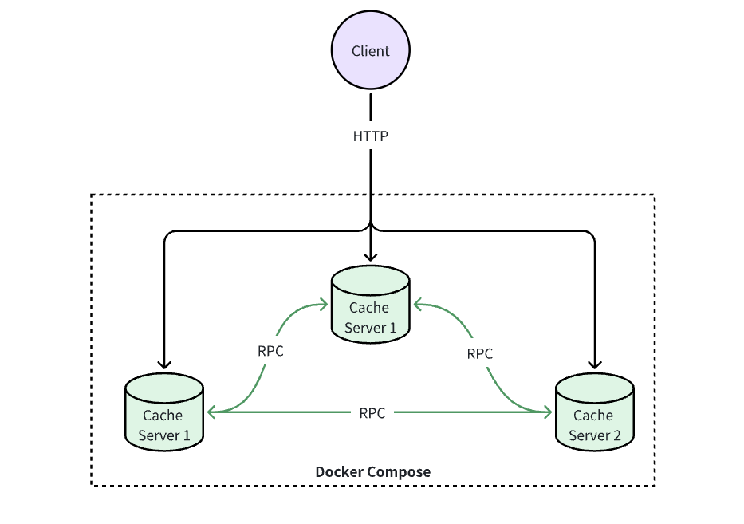

# 分布式大作业

## 目标

完成一个简易分布式系统

## 要求

1. Cache数据以Key-value形式存储在缓存系统节点内存中（不需要持久化）；
2. Cache数据以既定策略（round-robin或hash均可，不做限定）分布在不同节点（不考虑副本存储）；
3. 服务至少启动3个节点，不考虑节点动态变化；
    - 所有节点均提供HTTP访问入口；
    - 客户端读写访问可从任意节点接入，每个请求只支持一个key存取；
    - 若数据所在存储服务器与接入服务器不同，接入服务器通过内部RPC从目标存储服务器获取数据，再返回至客户端。

        

4. HTTP API约定
    - Content-type: application/json; charset=utf-8
    - 写入/更新缓存：POST /。使用HTTP POST方法，请求发送至根路径，请求体为JSON格式的KV内容，示例如下：

        ```Bash
        curl -XPOST -H "Content-type: application/json" http://server1/ -d '{"myname": "电子科技大学@2023"}'
        curl -XPOST -H "Content-type: application/json" http://server2/ -d '{"tasks": ["task 1", "task 2", "task 3"]}'
        curl -XPOST -H "Content-type: application/json" http://server3/ -d '{"age": 123}'
        ```
    
    - 读取缓存 GET /{key}。使用HTTP GET方法，key直接拼接在根路径之后。为简化程序，对key格式不做要求。

        ```Bash
        # 1. 正常：返回HTTP 200，body为JSON格式的KV结果；
        # 2. 错误：返回HTTP 404，body为空。
        curl http://server2/myname
        {"myname": "电子科技大学@2023"}

        curl http://server1/tasks
        {"tasks": ["task 1", "task 2", "task 3"]}

        curl http://server1/notexistkey
        # 404, not found
        ```

    - 删除缓存 DELETE /{key}。返回HTTP 200，body为删除的数量。

        ```Bash
        curl -XDELETE http://server3/myname
        1

        curl http://server1/myname
        # 404, not found

        curl -XDELETE http://server3/myname
        0
        ```

## 提交 & 测试

1. 提交内容：实验报告和程序代码包（合并一个zip）
2. 实验报告：描述系统设计和实现，突出重点；
3. 程序代码包：
    - 不限语言，提交程序源代码（仅限源代码，不得包括.git，动态拉取的第三方包，编译中间文件，最终可执行文件等。如果打包后有几十兆甚至更大，大概率包含了不该有的内容。）
    - 程序必须基于docker打包，并通过docker compose启动运行（每个cache server为一个docker实例）；
    
        ```Bash
        # Dockerfile：保证执行docker build可构建成功（会作为评分依据）。为了减少批改作业时构建docker镜像数据传输量，请统一使用ubuntu:20.04为基础镜像（如下）。

        FROM ubuntu:20.04
        # add your own codes

        # start your application, one docker one cache server
        # ENTRYPOINT []
        ```
    - compose.yaml：能直接启动不少于规定数量的cache server。每个server将内部HTTP服务端口映射至Host，外部端口从9527依次向后，即若启动3个server，则通过http://127.0.0.1:9527，http://127.0.0.1:9528，http://127.0.0.1:9529可分别访问3个cache server。
    - 测试脚本。批改作业会执行此测试脚本，也欢迎各位同学提PR，完善测试覆盖。